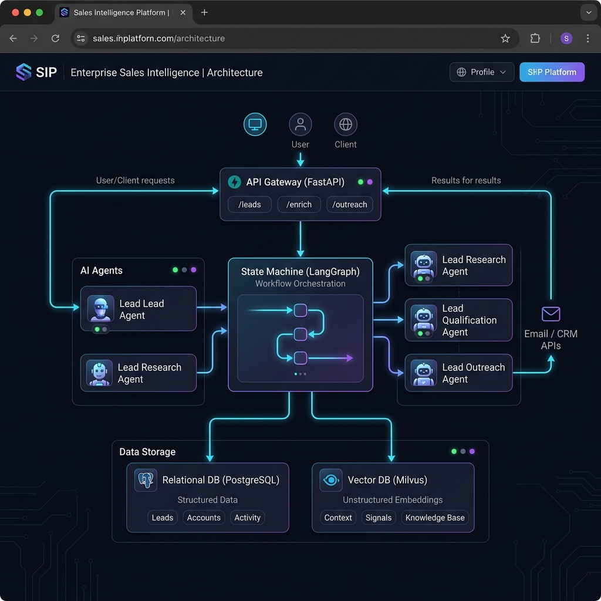

# Enterprise Multi-Agent Sales Intelligence Platform

This is a production-ready, asynchronous backend for the Enterprise Sales Intelligence Platform. The platform uses a cooperative multi-agent system powered by **CrewAI** and **LangGraph** to automate corporate lead discovery, company research, qualification, outreach draft generation, and human review processes.

## Platform Architecture



## Tech Stack

- **Python 3.12**
- **FastAPI** (Web API Layer)
- **LangGraph** (Workflow State Machine)
- **CrewAI** (Agent Coordination)
- **Milvus** (Vector Database for RAG Playbooks)
- **Postgres** (Relational Database)
- **SQLAlchemy 2.0 & Alembic** (Database ORM & Migrations)
- **Docker & Docker Compose** (Containerization & Service Orchestration)

---

## Folder Structure

```text
backend/
├── app/
│   ├── api/             # API routes, auth validation, and RBAC
│   ├── agents/          # CrewAI agents (Research, Qualify, Outreach)
│   ├── graph/           # LangGraph workflow definition and state definition
│   ├── tools/           # Custom agent tools (company search, news, milvus retriever)
│   ├── services/        # Service layer (auth, milvus connect, llm, workflow)
│   ├── db/              # SQLAlchemy session initialization and model schemas
│   ├── rag/             # Document embedding and index logic for RAG
│   ├── schemas/         # Pydantic v2 validation DTOs
│   ├── repositories/    # Generic async repository pattern
│   ├── core/            # Config settings and exception classes
│   └── observability/   # Execution and token tracking metrics logger
├── tests/               # Pytest unit and integration tests
├── docker/              # Docker deployment configurations
├── alembic/             # Alembic database migration environment
├── scripts/             # Initial database seeding scripts
├── alembic.ini          # Alembic configuration
└── requirements.txt     # Python application dependencies
docker-compose.yml       # Docker compose multi-service definition
```

---

## Installation & Setup

### 1. Prerequisites
- [Docker](https://www.docker.com/products/docker-desktop/) installed and running.
- Python 3.12 (optional, if running tests locally outside of docker).

### 2. Configure Environment Variables
Copy the `.env.example` file to `.env` in the `backend/` directory:
```bash
cp backend/.env.example backend/.env
```
Fill in the configuration details, particularly your **LLM provider api keys**:
- `GEMINI_API_KEY`: Google Gemini API credentials (default provider).
- `OPENAI_API_KEY`: OpenAI API credentials.

### 3. Launch Services with Docker Compose
To build and run all services (FastAPI application, Postgres, Milvus, etcd, MinIO):
```bash
docker-compose up --build
```
This command starts:
- **FastAPI API** on port `8000`
- **PostgreSQL** on port `5432`
- **Milvus Vector Database** on port `19530`
- **MinIO Object Store** on port `9000` (Console on `9001`)
- **etcd** metadata service on port `2379`

---

## Database Migrations & Seeding

### 1. Run Alembic Database Migrations
To initialize the Postgres relational schema, run migrations inside the running API container:
```bash
docker-compose exec api alembic revision --autogenerate -m "initial_schema"
docker-compose exec api alembic upgrade head
```

### 2. Seed Sales Playbooks (Milvus Standalone)
To index the default sales playbooks and pitch templates into Milvus Standalone, run the seeding script:
```bash
docker-compose exec api python scripts/seed_playbooks.py
```

---

## Running Automated Tests

To execute unit and integration tests with `pytest` locally:
1. Create a virtual environment and install dependencies:
   ```bash
   cd backend
   python -m venv venv
   source venv/bin/activate
   pip install -r requirements.txt
   ```
2. Run tests:
   ```bash
   pytest tests/
   ```

---

## API Endpoints Walkthrough

### 1. User Registration & JWT Authentication
Bootstrap a user with the **manager** role (authorized to run lead searches and reviews):
- **POST** `/api/auth/register`
  ```json
  {
    "email": "manager@acme.com",
    "password": "manager_password_123",
    "role": "manager"
  }
  ```
Retrieve the JWT token:
- **POST** `/api/auth/login` (send as `x-www-form-urlencoded` fields):
  - `username`: `manager@acme.com`
  - `password`: `manager_password_123`

### 2. Trigger Lead Mining Workflow
Start lead generation using target criteria (headers: `Authorization: Bearer <TOKEN>`):
- **POST** `/api/lead-search`
  ```json
  {
    "target_criteria": {
      "industry": "Robotics",
      "company_size": "Enterprise",
      "region": "Midwest"
    }
  }
  ```
Response:
```json
{
  "workflow_run_id": "c1a96c3c-6238-4e89-980b-22005a98d361",
  "status": "RUNNING"
}
```

### 3. Check Workflow Run State
Follow status:
- **GET** `/api/workflow/c1a96c3c-6238-4e89-980b-22005a98d361`
When the run reaches the human review stage, its status transitions to `AWAITING_REVIEW`.

### 4. Human Review (Approval & Outreach Customization)
Submit approval or adjustments for outreach drafts to resume the workflow:
- **POST** `/api/workflow/c1a96c3c-6238-4e89-980b-22005a98d361/review`
  ```json
  {
    "approved": true,
    "modified_draft": {
      "email_subject": "Optimizing Acme Corp's warehouse automation",
      "email_body": "Hi Acme team, customized pitch copy here...",
      "linkedin_message": "Hi, let's connect regarding robotic systems scaling.",
      "sales_angle": "Robotics focus"
    }
  }
  ```
Once approved, the status transitions to `COMPLETED` and outreach records are finalized.
