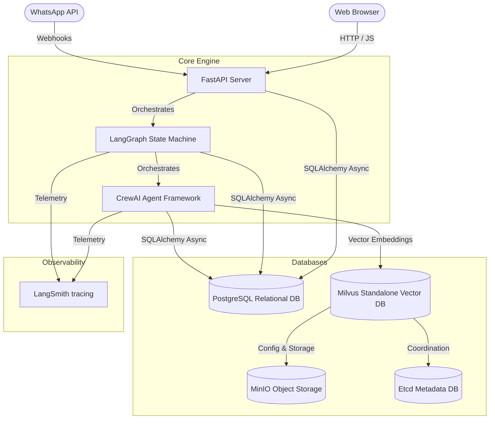

# System Design Specification: Enterprise Sales Intelligence Platform

This document details the **Product Requirements Document (PRD)**, **High-Level Design (HLD)**, and **Low-Level Design (LLD)** for the Enterprise Multi-Agent Sales Intelligence Platform.

---

## Part 1: Product Requirements Document (PRD)

### 1. Product Overview
The Enterprise Sales Intelligence Platform is an autonomous, agent-driven workflow engine designed to automate top-of-funnel sales development. The platform discovers company prospects, conducts deep web-scraping and similarity-based playbook research (RAG), scores leads against target ICP criteria, and generates hyper-personalized email/LinkedIn outreach messages. It integrates a web dashboard and mobile WhatsApp triggers for human-in-the-loop validation.

### 2. User Personas
*   **Sales Manager (Manager):** Triggers industry discovery workflows, configures scoring criteria, and reviews/approves draft copy.
*   **Sales Representative (Representative):** Inspects prospect profiles and reads compiled research. Access is read-only.
*   **Administrator (Admin):** Manages users, credentials, and playbooks.

### 3. Key Functional Features
*   **Lead Discovery:** Automatic discovery of company domain leads based on industry queries.
*   **Multi-Agent Research (RAG):** Contextual enrichment via scraped news, growth signals, and sales playbooks.
*   **Ideal Customer Profile (ICP) Scoring:** Evaluates leads against targets and gives a score from 0-100.
*   **Outreach Generation:** Automated copywriting matching value propositions.
*   **Human-in-the-Loop Validation:** Pausing workflow execution to await review via Dashboard or Meta WhatsApp.
*   **Observability:** Automated cost, latency, and prompt tracing via LangSmith.

---

## Part 2: High-Level Design (HLD)

### 1. System Architecture
The application is structured as a multi-service containerized architecture:



### 2. Core Service Interactions
1.  **FastAPI Endpoint** receives the target industry and starts a background thread.
2.  **LangGraph State Machine** manages the step-by-step state transition and writes execution state.
3.  **CrewAI Agents** execute tasks sequentially, querying the Web and the **Milvus Vector DB** (via Sentence-Transformers RAG embeddings) for contextual playbooks.
4.  **PostgreSQL** records state, logs, and outputs at every stage.

---

## Part 3: Low-Level Design (LLD)

### 1. Database Schema (PostgreSQL)

```sql
-- Users and Roles
CREATE TABLE users (
    id SERIAL PRIMARY KEY,
    email VARCHAR UNIQUE NOT NULL,
    hashed_password VARCHAR NOT NULL,
    role VARCHAR NOT NULL DEFAULT 'representative', -- admin, manager, representative
    is_active BOOLEAN DEFAULT TRUE
);

-- Discovered Leads
CREATE TABLE leads (
    id SERIAL PRIMARY KEY,
    company_name VARCHAR UNIQUE NOT NULL,
    domain VARCHAR NOT NULL,
    industry VARCHAR NOT NULL,
    score INTEGER DEFAULT 0,
    status VARCHAR NOT NULL DEFAULT 'discovered', -- discovered, researched, qualified, disqualified, outreach_generated
    created_at TIMESTAMP DEFAULT CURRENT_TIMESTAMP
);

-- Research Reports (RAG & Scraping outputs)
CREATE TABLE research_reports (
    id SERIAL PRIMARY KEY,
    lead_id INTEGER REFERENCES leads(id) ON DELETE CASCADE,
    profile TEXT NOT NULL,
    growth_signals JSONB,
    hiring_signals JSONB,
    tech_adoption JSONB,
    risks TEXT,
    raw_report TEXT,
    created_at TIMESTAMP DEFAULT CURRENT_TIMESTAMP
);

-- Outreach Messages (Drafts & Sent Copies)
CREATE TABLE outreach_messages (
    id SERIAL PRIMARY KEY,
    lead_id INTEGER REFERENCES leads(id) ON DELETE CASCADE,
    email_subject VARCHAR,
    email_body TEXT,
    linkedin_message TEXT,
    sales_angle VARCHAR,
    status VARCHAR DEFAULT 'draft', -- draft, finalized, sent
    created_at TIMESTAMP DEFAULT CURRENT_TIMESTAMP
);
```

### 2. Vector Schema (Milvus Collection: `sales_playbooks`)
Used for RAG contextual lookup of sales strategies and objection handling guides.
*   **Field: `id`** (INT64) - Primary Key (AutoID)
*   **Field: `vector`** (FLOAT_VECTOR, Dim: 384) - Embedded using `all-MiniLM-L6-v2`
*   **Field: `industry`** (VARCHAR) - Metadata query filtering
*   **Field: `playbook_name`** (VARCHAR) - Playbook filename
*   **Field: `text_content`** (VARCHAR) - Raw playbook content

### 3. Agent Configurations & Prompts
*   **Company Intelligence Analyst:**
    *   *Backstory:* Expert in corporate intelligence, scraping technology adoptions, and funding rounds.
    *   *Goal:* Scraping lead data and finding growth/hiring signals.
*   **Sales Operations Analyst:**
    *   *Backstory:* Veteran metrics specialist scoring leads based on ICP fit.
    *   *Goal:* Comparing reports against target criteria and returning a score from 0-100.
*   **Sales Copywriter:**
    *   *Backstory:* Creative copywriter specializing in converting leads.
    *   *Goal:* Crafting personalized email and InMail drafts based on RAG context.

### 4. API Specification

| Endpoint | Method | Role Required | Description |
| :--- | :--- | :--- | :--- |
| `/api/auth/register` | POST | Anonymous | Registers a new user |
| `/api/auth/token` | POST | Anonymous | User authentication & JWT generation |
| `/api/frontend/leads` | GET | Representative+ | Fetches leads list |
| `/api/frontend/workflow/run`| POST | Manager+ | Starts autonomous LangGraph pipeline |
| `/api/frontend/workflow/review`| POST | Manager+ | Submits approvals / resume checkpoint |
| `/api/whatsapp/webhook` | POST | Anonymous | Webhook for Meta WhatsApp bot commands |
